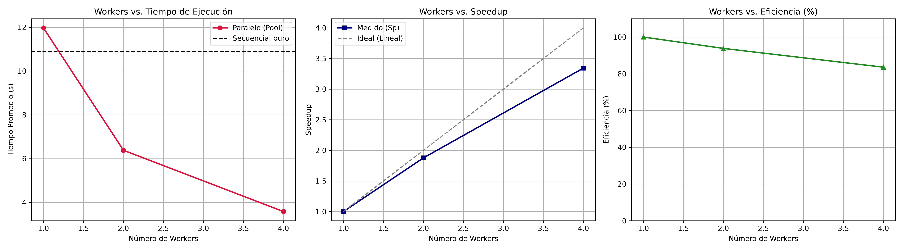

# EC. Primer Parcial — Proyecto Práctico HPC

**Asignatura:** Cómputo de Alto Rendimiento

**Integrantes:**
1. Diego Cortes Zermeño (@DiegoZerm)
2. Cesar Ivan Ramirez Castañon (@tprogcesarramirez-dotcom)
3. Irving Nahir Ferrusca Jaimez (@irvingjaimez)

## Descripción

Este proyecto compara la ejecución **secuencial** y **paralela** de un programa en Python que procesa una cantidad considerable de datos: se evalúa la función

$$f(x) = \sqrt{x} + x^2 + \sin(x) + \cos(x) + \ln(x)$$

sobre un vector de **25 000 000 de elementos** (200 MB en `float64`).

La versión **secuencial** recorre todo el vector en un solo proceso. La versión **paralela** divide el vector en bloques con `np.array_split` y los distribuye entre **1, 2 y 4 workers** usando `multiprocessing.Pool` + `pool.map`, ejecutando **3 repeticiones por configuración** para promediar los tiempos. Con los promedios se calculan el **Speedup** ($S_p = T_1 / T_p$) y la **Eficiencia** ($E_p = S_p / p$), y se generan automáticamente las gráficas de rendimiento.

## Cómo ejecutar

```bash
pip install -r requirements.txt
jupyter notebook notebook_hpc.ipynb
```

Luego: **Run → Run All Cells** y guardar con `Ctrl+S`.

La ejecución completa tarda aproximadamente **2–3 minutos**. Al finalizar se registran en el cuaderno la tabla de métricas y las gráficas, y se genera el archivo `hpc_performance_results.png`.

## Hardware utilizado

- **Procesador:** AMD Ryzen 7 7435HS
- **Núcleos / hilos:** 8 núcleos físicos / 16 hilos lógicos (1 socket)
- **RAM:** 15 GiB (DDR, ~11 GiB disponibles durante la corrida)
- **Sistema operativo:** Linux Mint 22.2 «Zara» — kernel 7.0.0-38-generic (x86_64)

## Resultados

| Configuración | Prueba 1 | Prueba 2 | Prueba 3 | Promedio (s) | Speedup | Eficiencia |
|---|---|---|---|---|---|---|
| Secuencial | 10.9243 | 10.8759 | 10.8811 | **10.8938** | – | – |
| 1 worker | 12.0673 | 11.9101 | 11.9410 | **11.9728** | 1.00 | 100 % |
| 2 workers | 6.4301 | 6.3903 | 6.3231 | **6.3812** | 1.88 | 93.81 % |
| 4 workers | 3.6270 | 3.5649 | 3.5509 | **3.5809** | 3.34 | 83.59 % |

*Speedup y Eficiencia calculados contra el tiempo de 1 worker (11.9728 s), según la definición del cuaderno.*


